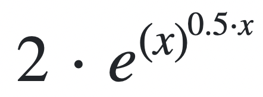
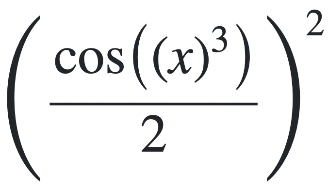
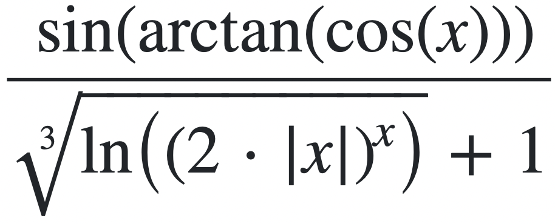

# Лабораторная работа №1

## Варинат №30021

### Отчет
[pdf](./reports/report.pdf), [docx](./reports/report.docx)

### Текст задания

Написать программу на языке Java, выполняющую соответствующие варианту действия. Программа должна соответствовать следующим требованиям:

1. Она должна быть упакована в исполняемый jar-архив.
2. Выражение должно вычисляться в соответствии с правилами вычисления математических выражений (должен соблюдаться порядок выполнения действий и т.д.).
3. Программа должна использовать математические функции из стандартной библиотеки Java.
4. Результат вычисления выражения должен быть выведен в стандартный поток вывода в заданном формате.

Выполнение программы необходимо продемонстрировать на сервере helios.

1. Создать одномерный массив b типа int. Заполнить его чётными числами от 2 до 16 включительно в порядке возрастания.
2. Создать одномерный массив x типа float. Заполнить его 12-ю случайными числами в диапазоне от -6.0 до 15.0.
3. Создать двумерный массив e размером 8x12. Вычислить его элементы по следующей формуле (где x = x[j]):
  - если b[i] = 10, то e[i][j] = 
  - если b[i] ∈ {2, 6, 8, 16}, то e[i][j] = 
  - для остальных значений b[i]: e[i][j] = 

Напечатать полученный в результате массив в формате с четырьмя знаками после запятой.
