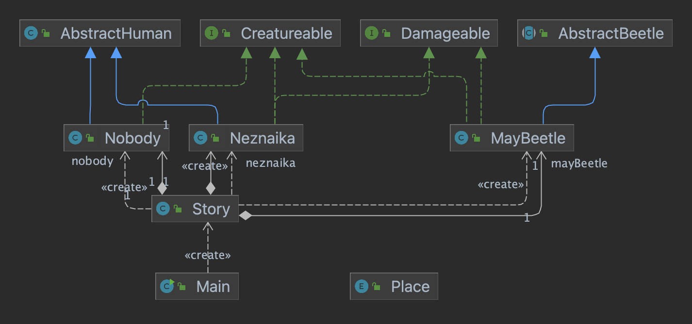

# Лабораторная работа №3

## Варинат №90001

### Отчет
[pdf](./reports/report.pdf), [docx](./reports/report.docx)

### Текст задания

**Описание предметной области, по которой должна быть построена объектная модель:**

```
В особенности Незнайка прославился после одной истории. Однажды он гулял по 
городу и забрел в поле. Вокруг не было ни души. В это время летел майский жук. 
Он сослепу налетел на Незнайку и ударил его по затылку. Незнайка кубарем 
покатился на землю. Жук в ту же минуту улетел и скрылся вдали. Незнайка 
вскочил, стал оглядываться по сторонам и смотреть, кто это его ударил. Но 
кругом никого не было.
```

**Программа должна удовлетворять следующим требованиям:**

1. Доработанная модель должна соответствовать [принципам SOLID](https://en.wikipedia.org/wiki/SOLID).
2. Программа должна содержать как минимум два интерфейса и один абстрактный класс (номенклатура должна быть согласована с преподавателем).
3. В разработанных классах должны быть переопределены методы `equals()`, `toString()` и `hashCode()`.
4. Программа должна содержать как минимум один перечисляемый тип (enum).

### UML-диаграмма классов
