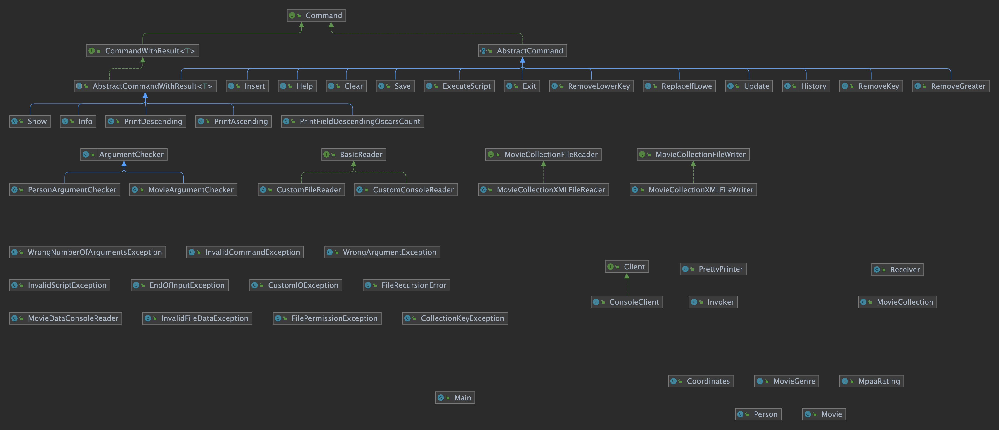

# Лабораторная работа №5

## Вариант №3131010

### Отчет
[pdf](./reports/report.pdf), [docx](./reports/report.docx)

### Текст задания

Реализовать консольное приложение, которое реализует управление коллекцией объектов в интерактивном режиме. В коллекции необходимо хранить объекты класса `Movie`, описание которого приведено ниже.

**Разработанная программа должна удовлетворять следующим требованиям:**
- Класс, коллекцией экземпляров которого управляет программа, должен реализовывать сортировку по умолчанию.
- Все требования к полям класса (указанные в виде комментариев) должны быть выполнены.
- Для хранения необходимо использовать коллекцию типа `java.util.HashMap`
- При запуске приложения коллекция должна автоматически заполняться значениями из файла.
- Имя файла должно передаваться программе с помощью: переменная окружения.
- Данные должны храниться в файле в формате `xml`
- Чтение данных из файла необходимо реализовать с помощью класса `java.util.Scanner`
- Запись данных в файл необходимо реализовать с помощью класса `java.io.OutputStreamWriter`
- Все классы в программе должны быть задокументированы в формате `javadoc`.
- Программа должна корректно работать с неправильными данными (ошибки пользовательского ввода, отсутсвие прав доступа к файлу и т.п.).

**В интерактивном режиме программа должна поддерживать выполнение следующих команд:**
- `help` : вывести справку по доступным командам
- `info` : вывести в стандартный поток вывода информацию о коллекции (тип, дата инициализации, количество элементов и т.д.)
- `show` : вывести в стандартный поток вывода все элементы коллекции в строковом представлении
- `insert null {element}` : добавить новый элемент с заданным ключом
- `update id {element}` : обновить значение элемента коллекции, `id` которого равен заданному
- `remove_key null` : удалить элемент из коллекции по его ключу
- `clear` : очистить коллекцию
- `save` : сохранить коллекцию в файл
- `execute_script file_name` : считать и исполнить скрипт из указанного файла. В скрипте содержатся команды в таком же виде, в котором их вводит пользователь в интерактивном режиме.
- `exit` : завершить программу (без сохранения в файл)
- `remove_greater {element}` : удалить из коллекции все элементы, превышающие заданный
- `replace_if_lowe null {element}` : заменить значение по ключу, если новое значение меньше старого
- `remove_lower_key null` : удалить из коллекции все элементы, ключ которых меньше, чем заданный
- `print_ascending` : вывести элементы коллекции в порядке возрастания
- `print_descending` : вывести элементы коллекции в порядке убывания
- `print_field_descending_oscars_count` : вывести значения поля `oscarsCount` всех элементов в порядке убывания

**Формат ввода команд:**
- Все аргументы команды, являющиеся стандартными типами данных (примитивные типы, классы-оболочки, `String`, классы для хранения дат), должны вводиться в той же строке, что и имя команды.
- Все составные типы данных (объекты классов, хранящиеся в коллекции) должны вводиться по одному полю в строку.
- При вводе составных типов данных пользователю должно показываться приглашение к вводу, содержащее имя поля (например, "Введите дату рождения:")
- Если поле является `enum`'ом, то вводится имя одной из его констант (при этом список констант должен быть предварительно выведен).
- При некорректном пользовательском вводе (введена строка, не являющаяся именем константы в `enum`'е; введена строка вместо числа; введённое число не входит в указанные границы и т.п.) должно быть показано сообщение об ошибке и предложено повторить ввод поля.
- Для ввода значений `null` использовать пустую строку.
- Поля с комментарием "Значение этого поля должно генерироваться автоматически" не должны вводиться пользователем вручную при добавлении.

**Описание хранимых в коллекции классов:**

```java
public class Movie {
    private int id; //Значение поля должно быть больше 0, Значение этого поля должно быть уникальным, Значение этого поля должно генерироваться автоматически
    private String name; //Поле не может быть null, Строка не может быть пустой
    private Coordinates coordinates; //Поле не может быть null
    private java.time.LocalDateTime creationDate; //Поле не может быть null, Значение этого поля должно генерироваться автоматически
    private Long oscarsCount; //Значение поля должно быть больше 0, Поле не может быть null
    private MovieGenre genre; //Поле может быть null
    private MpaaRating mpaaRating; //Поле не может быть null
    private Person director; //Поле может быть null
}

public class Coordinates {
    private Long x; //Максимальное значение поля: 108, Поле не может быть null
    private double y;
}

public class Person {
    private String name; //Поле не может быть null, Строка не может быть пустой
    private Float height; //Поле может быть null, Значение поля должно быть больше 0
    private float weight; //Значение поля должно быть больше 0
    private String passportID; //Строка не может быть пустой, Поле может быть null
}

public enum MovieGenre {
    WESTERN,
    MUSICAL,
    THRILLER,
    FANTASY
}

public enum MpaaRating {
    G,
    PG,
    PG_13,
    R,
    NC_17
}
```

### UML-диаграмма классов

